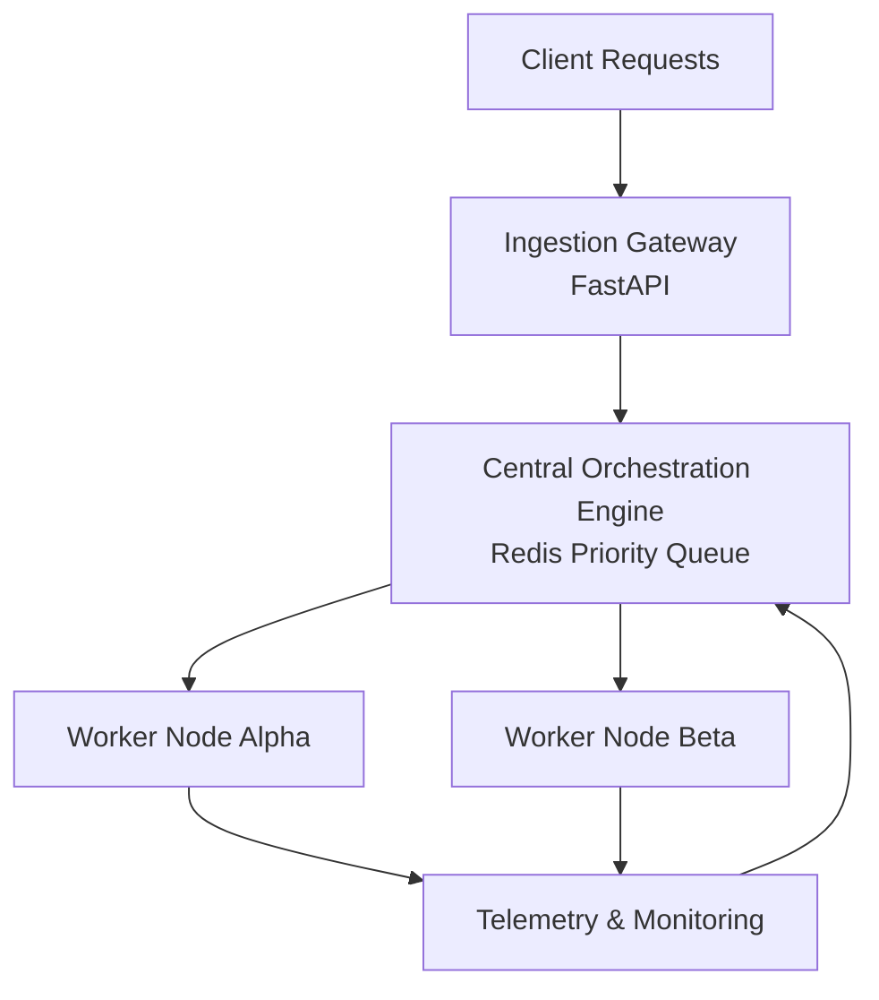

# OrchestraAI

A high-throughput, concurrent resource allocation and scheduling platform designed to optimize asynchronous AI inference workloads across distributed worker environments. 

OrchestraAI bridges the gap between hardware-constrained environments and demanding AI execution pipelines, implementing custom thread-synchronization primitives, priority-based min-heap queues, and edge-optimized model quantization profiles to eliminate system bottlenecks.

---

## 🏗️ Architectural Overview

OrchestraAI decouples ingestion, orchestration, and compute layers to ensure maximum uptime, low dispatch tail latency, and complete fault tolerance.

1. **Ingestion Gateway:** An asynchronous FastAPI web node parsing incoming inference contracts, validating structural properties, and injecting scheduling signatures.
2. **Central Orchestration Engine:** A Redis-backed global state registry and min-heap sorting layer prioritizing jobs based on real-time SLA urgency thresholds.
3. **Concurrent Worker Pools:** Multi-threaded computation runtimes execution context isolated via strict mutual exclusion (`mutex`) boundaries to execute compressed INT8 quantized AI models.
4. **Telemetry & Fault Monitoring Daemon:** A background loop monitoring active worker node signatures. Mitigates failures by initiating automatic transaction rollbacks and task re-queuing during thread drops.

---

## ⚡ Core Technical Features & Primitives

### 🏎️ High-Throughput Concurrency & Synchronization
To avoid standard race conditions where duplicate workers extract identical workloads simultaneously, OrchestraAI isolates job extraction loops inside thread-safe critical sections. It utilizes underlying Redis atomic transactions (`BLPOP`/Lua scripts) or low-level thread-locking mechanisms, guaranteeing strictly consistent single-task allocations.

### 📉 Post-Training Quantization (PTQ)
Rather than executing resource-heavy, floating-point AI matrices, model graphs (e.g., BERT, ResNet) are compiled to the ONNX runtime. Tensor weights are transformed from standard 32-bit floats (`float32`) to 8-bit signed integers (`int8`). This achieves a math-proven **4x memory reduction**, directly accelerating execution throughput across memory-bounded CPU/GPU workers.

### 🛠️ Fault Tolerance & State Recovery
If a worker thread encounters an unhandled exception or critical runtime termination mid-inference, the isolation layer prevents a global crash. The monitor daemon detects the stale heartbeats, invalidates the worker's allocation profile, tracks down the in-flight tasks, and safely pushes them back to the active execution loop.