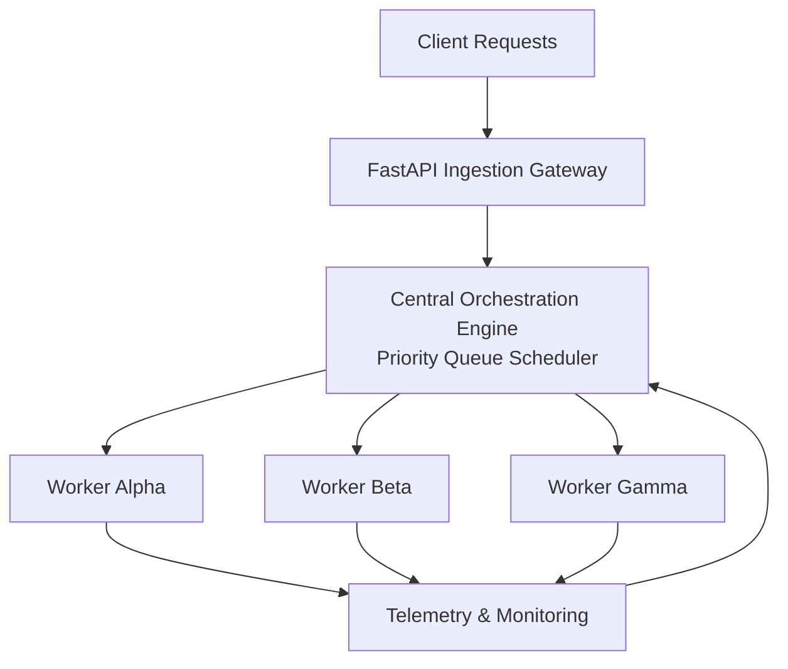

# OrchestraAI


A distributed AI workload orchestration system built to explore concurrency, priority scheduling, worker pools, telemetry, and fault-tolerant task execution.

OrchestraAI is designed as a learning-focused infrastructure project that simulates how modern AI platforms manage, schedule, execute, and monitor workloads across multiple workers. The project emphasizes systems engineering concepts such as thread synchronization, queue management, fault recovery, and performance monitoring.

---

## Why OrchestraAI?

Modern AI systems must handle thousands of requests with varying priorities, execution times, and resource requirements.

OrchestraAI explores the core infrastructure patterns behind large-scale AI platforms by implementing:

- Priority-based job scheduling
- Concurrent worker execution
- Thread-safe resource management
- Fault-tolerant task processing
- Real-time telemetry and monitoring
- AI inference workload orchestration

The goal is not to build another AI model, but to understand how AI workloads are managed efficiently in production environments.

---

## Architecture



---

## Core Components

### 1. Ingestion Gateway

The entry point of the system.

Responsibilities:

- Accept incoming requests
- Validate request payloads
- Assign job metadata
- Forward jobs to the orchestration layer

Planned Technologies:

- FastAPI
- Pydantic
- Uvicorn

---

### 2. Central Orchestration Engine

Responsible for managing and dispatching jobs.

Responsibilities:

- Maintain priority queues
- Track worker availability
- Schedule jobs efficiently
- Coordinate execution flow

Planned Technologies:

- Python PriorityQueue
- Redis (future upgrade)

---

### 3. Concurrent Worker Pool

Executes incoming jobs in parallel.

Responsibilities:

- Pull tasks from queue
- Execute workloads
- Update execution status
- Report metrics

Planned Technologies:

- threading
- ThreadPoolExecutor

---

### 4. Telemetry & Monitoring

Observes system behavior in real time.

Responsibilities:

- Track worker health
- Measure latency
- Monitor throughput
- Detect failures

Planned Technologies:

- Python logging
- Custom metrics collection

---

### 5. Fault Recovery Layer

Ensures reliable execution.

Responsibilities:

- Detect worker failures
- Requeue unfinished jobs
- Maintain system consistency

Planned Technologies:

- Heartbeat monitoring
- Automatic task recovery

---

## Planned Features

### Phase 1 — FastAPI Gateway

- Project setup
- FastAPI server
- Request validation
- Health check endpoint

### Phase 2 — Job Queue System

- Job models
- Priority queue
- Queue manager

### Phase 3 — Worker Pool

- Multi-threaded workers
- Concurrent execution
- Thread-safe operations

### Phase 4 — Telemetry

- Logging
- Metrics tracking
- Worker monitoring

### Phase 5 — Fault Recovery

- Heartbeat system
- Failure detection
- Job requeuing

### Phase 6 — Redis Integration

- Distributed queues
- Shared worker state
- Improved scalability

### Phase 7 — AI Workload Execution

- ONNX Runtime
- Model loading
- Quantized inference

### Phase 8 — Performance Benchmarking

- Load testing
- Throughput measurement
- Latency analysis
- Resource profiling

---

## Project Structure

```text
OrchestraAI/
│
├── app/
│   ├── main.py
│   ├── models.py
│   ├── queue_manager.py
│   ├── worker.py
│   ├── telemetry.py
│   └── config.py
│
├── tests/
│
├── docs/
│
├── scripts/
│
├── README.md
├── requirements.txt
├── .gitignore
└── run.py
```

---

## Technologies

- Python 3.11+
- FastAPI
- Pydantic
- Uvicorn
- Redis
- ONNX Runtime
- Pytest
- Docker

---

## Learning Objectives

Through this project, the goal is to gain practical experience with:

- Git & GitHub workflows
- REST APIs
- Concurrent programming
- Thread synchronization
- Priority queues and heaps
- Distributed systems fundamentals
- Monitoring and observability
- AI infrastructure engineering

---

## Current Status

🚧 Active Development

### Completed

- Repository setup
- Project structure creation
- Initial architecture design
- GitHub repository configuration

### Next Milestone

Build the FastAPI Ingestion Gateway and implement the first API endpoint.

---

## License

MIT License
